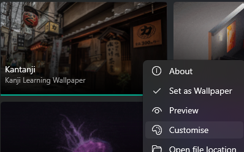

# Lively Kanji

With [KanTanJi](https://kanjibase.github.io/KanTanJi/), you can turn your wallpapers into kanji learning app. Simply paste this repository into

`<user profile>/AppData/Local/Lively Wallpaper/Library/wallpapers/` (or the wallpaper folder for your target platform),

and set this wallpaper as the active one. You can select then `Menu -> Customize` and paste desired JSON data pack from [KanTanJi](https://kanjibase.github.io/KanTanJi/).

